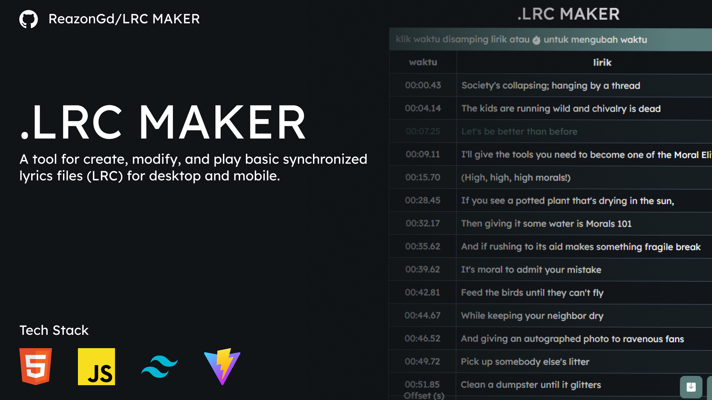

# LRC MAKER

A tool for create, modify, and play basic synchronized lyrics files (LRC) for desktop and mobile.

## Table of content

- [How to use](#how-to-use)
- [Features](#features)
- [License](#license)

## How to use

1. **Upload An Audio**: Click the 'Select Audio' button to select your audio file.
2. **Add Lyrics**: Enter the lyrics then click next.
3. **Timestamp Lyrics**: Use the button that look like stopwach on right bottom to add timestamps.
4. **Save and Export**: Click the save button on left side of stopwach button to open save & copy page

## Features

- Load File with drag and drop feature.
- Simple time staping.
- Light & Dark mode theme.
- Have 2 Language option.
- Save as .lrc file or copy option.
